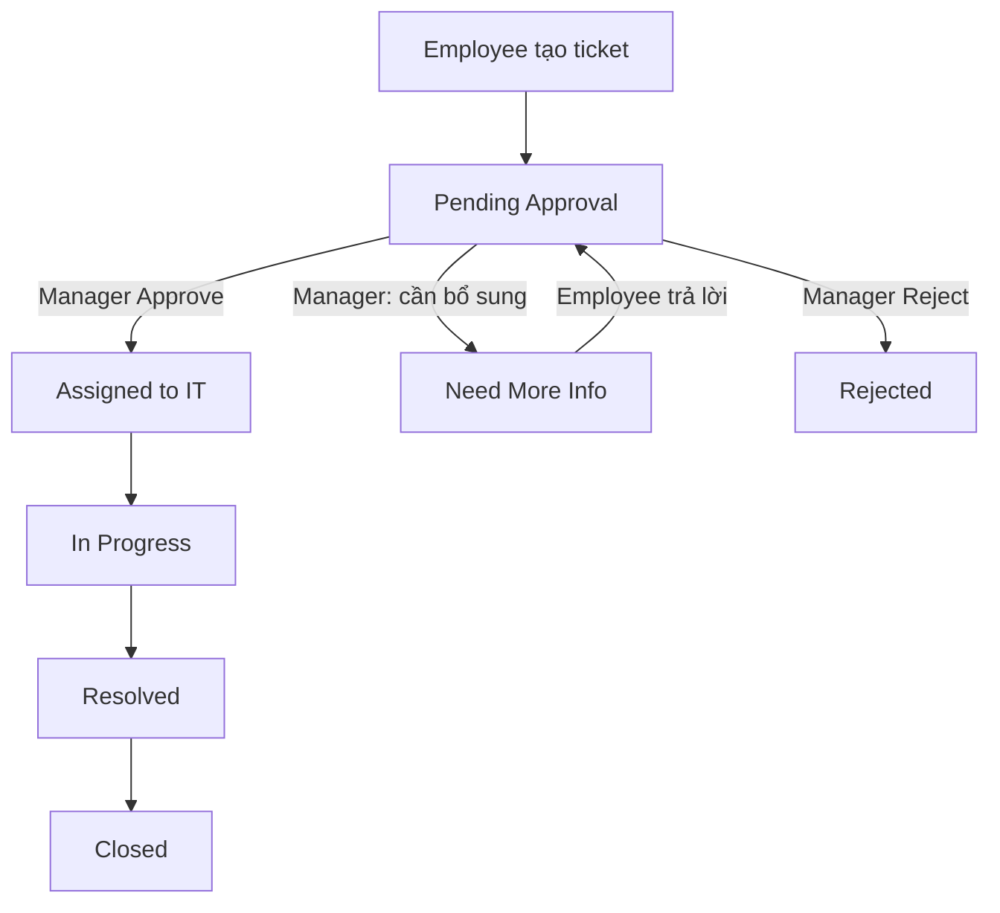

# Kiến trúc hệ thống

## 1. Tổng quan

**IT Support Ticket System** là một SPA (Single Page Application) xây bằng **React + TypeScript + Vite + Ant Design**, xác thực bằng **Microsoft Entra ID (MSAL.js)**, lưu dữ liệu trên **SharePoint Lists** và file trên **SharePoint Document Library**, với nghiệp vụ & tự động hóa chạy trên **Power Automate**.

```
┌─────────────────────────────┐        ┌───────────────────────────────┐
│        React SPA (Vite)     │        │      Microsoft Cloud          │
│  - MSAL.js login            │──────▶ │  1. Microsoft Entra ID        │
│  - Ant Design UI (Outlook)  │        │     (id_token + access token) │
│  - TipTap Rich Text Editor  │        │  2. Microsoft Graph API       │
│  - Role-based routing       │        │     · SharePoint Lists        │
└─────────────┬───────────────┘        │     · SharePoint Drive (files)│
              │                        └──────────────┬────────────────┘
              │ access token                          │
              ▼                                        ▼
      ┌──────────────────┐                 ┌─────────────────────┐
      │ Power Automate   │                 │  SharePoint Online   │
      │ HTTP-trigger flows│                │  ┌───────────────┐   │
      │ (nghiệp vụ +      │◀─── đọc/ghi ──▶│  │ Tickets       │   │
      │  thông báo email) │                │  │ TicketComments│   │
      └──────────────────┘                │  │ UserRoles     │   │
                                           │  │ TicketAttach..│   │
                                           │  └───────────────┘   │
                                           └─────────────────────┘
```

## 2. Luồng dữ liệu (Data flow)

1. User đăng nhập qua **MSAL** → nhận `id_token` và `access_token` (scopes: `User.Read`, `Sites.Read.All`, `Files.ReadWrite.All`).
2. App đọc **Role** từ List `UserRoles` (qua flow `getUserRole`, fallback Graph) → cấp quyền giao diện theo role.
3. User tạo ticket → gọi flow `createTicket` → tạo item trong List `Tickets` (status **Pending Approval**) → Power Automate gửi email cho **Manager**.
4. **Manager** Approve/Reject/yêu cầu bổ sung → flow `updateStatus`/`assignIT` cập nhật Status + thông báo.
5. **IT** xử lý → thay đổi Status → thông báo Employee.
6. Mọi comment (`addComment`/`getComments`) lưu vào List `TicketComments`; file/ảnh upload lên Drive folder `Tickets/{ticketId}` qua Graph.

## 3. Luồng nghiệp vụ (Business flow)



- **employee**: tạo ticket, xem ticket của mình, chỉ trả lời khi status = `Need More Info`.
- **manager**: Approve/Reject, yêu cầu bổ sung thông tin.
- **it**: toàn quyền xử lý sau khi được duyệt, comment nội bộ (`IsInternal`).

## 4. Trạng thái đọc (read/unread)

Danh sách `Tickets` không lưu "đã đọc" trên ticket (dùng chung). App lưu trạng thái đã đọc theo `(userId, ticketId)` qua một List phụ `TicketReadState` hoặc qua flow `markRead`. Trong code hiện tại, trường `isRead` được map từ `readState` trả về bởi flow `getTickets`.

## 5. Thư mục gợi ý thêm

| File/Service | Vai trò |
|---|---|
| `src/services/graphClient.ts` | Đọc/ghi SharePoint trực tiếp qua Graph (fallback) |
| `src/services/ticketsService.ts` | Nghiệp vụ ticket/comment, ưu tiên flow |
| `src/services/attachmentsService.ts` | Upload/download file qua OneDrive/Drive API |
| `src/context/RoleContext.tsx` | Nạp role + ma trận quyền |
| `src/components/RichTextEditor.tsx` | TipTap editor lớn, chỉnh chu |
